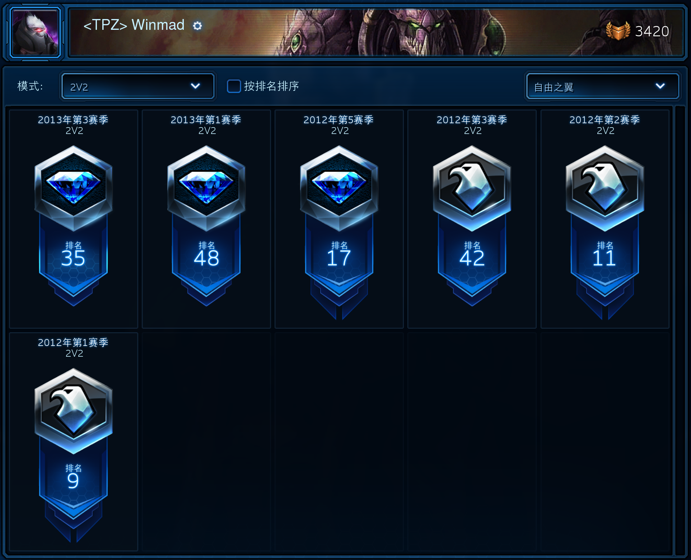



# The Ph.D. Games

## 序

我于2015年9月12日飞抵San Diego, 开始了我的博士生涯. 
2020年6月29日, 我顺利通过了论文答辩 (巧的是, 在同一天有几个同届的同学也完成了答辩). 
这五年海外求学于科研探索的苦与乐无需多言.
我想在这里记录的 (流水账), 是陪伴我度过空余时光的游戏们.
我在一个个精彩绝伦的虚拟世界中遨游, 它们是我博士生涯的重要组成部分.

和许多计算机图形学的研究者 (此处@老大) 一样, 从小开始的游戏生涯是驱使我走上这条道路的动力之一.
因此, 有必要在这里回顾一下我博士前的游戏经历.
我最早的游戏记忆, 是老爸带我在小霸王上打坦克大战.
后来我接触了电脑游戏, 第一个应该是一个叫雷电3的打飞机游戏.
2002年左右, 我玩到了天之痕, 华丽的技能特效 (横剑摆渡!) 深深吸引了我 (真正理解这个催人泪下的剧情是多年以后的事了).
同一年, 因为世界杯, 我又开始玩FIFA.
我记得当时那张游戏光盘, 是一个FIFA 98到FIFA 02的合集.
我最喜欢的是2002世界杯的特别版, 每个队的球星可以踢出带有"飞火流星"特效的球.
我开心地玩了很久, 带领许多球队勇夺世界杯, 但我有一个无法理解的问题: 为什么有时候球员不听我的控制?
直到一天有个哥哥来我家看我踢FIFA, 他说: "你在开始比赛之前怎么不用方向键选球队啊?"
我那时的心情, 可以用一个苏联笑话来形容.
火车突然在路上停了, 勃列日涅夫说: "同志们, 大家拉上窗帘, 坐在座位上自己摇动身体, 做出列车还在前进的样子."

在2003--2007年的大部分时间, 我都身陷韩式泡菜网游的巨坑.
我在这里列出这些老游戏, 不知道你有没有玩过其中的几个: 佣兵传说, 奇迹MU, 天翼之链, 彩虹冒险.
还有一些偏休闲向的网游, 比如泡泡堂 (幻影特效10元一个), 跑跑卡丁车, 各种QQ游戏 (常常周末和同学约线上升级).
至于单机游戏, 我也玩过许多经典和并不经典的作品: 红色警戒2, 伊苏6, 炮灰与马瓜 (一个国产战棋游戏), 魔兽争霸3, NBA LIVE.
这些游戏是我与同龄小伙伴们交流的重要纽带.
如果你在课间和我聊起这个话题, 我能滔滔不绝说上很久 (现在也是).
仔细观察可以发现, CS并不在我的游戏名单里.
也许这就是我直到现在都几乎不玩FPS游戏的主要原因. 
我输在了起跑线上.
你怎么可能打得过从小就在机房/网吧里跟人中门对狙的骨灰级玩家呢?

高中时代毫无争议的游戏王者则是Dota.
我玩的第一个版本是6.59 (Tinker可以刷新BKB).
在英雄和道具都认不全的时候, 我们乐此不疲地组队打AI (-nengap).
我必须要惭愧地承认, Dota在当时是SSOI组重要的团建活动 (我们都是在完成了当天的训练任务之后放松一下, 请现役的小朋友们不要学坏).
连接着新老SSOI成员的神圣羁绊, 不仅有各大题库的AC和WA, 还有5人开黑甚至10人对黑的愉快时光.
十多年过去了, 我仍然可以骄傲地说, 我虽然玩Dota玩得早, 但是我打得菜啊!

本科的4年并没有太多探索各种游戏的机会 (被N门姚课支配的恐惧依然历历在目, 每周要用latex写十几二十页的作业).
我的大部分时间献给了暴雪全家桶和Dota.
刚进大学的时候, 我认识了星际2的狂热玩家fuzerg.
他带着我打2v2, 取得了与我真实水平并不匹配的成绩.
我们能稳定打到钻石组, 而我单人天梯的实力一直在黄金和白银之间徘徊.
在某一次系里的9CG上 (似乎是大三的时候), 我们在2v2的比赛中一路过关, 最后在决赛战胜了唐总和沐神 (都是随机千胜的高手) 夺冠.
依稀记得决赛里, fuzerg提速狗, 我速虚空, 成功rush了下来.
还有一次神奇的经历, 是汤神带fuzerg和我去线下参加了一个北京高校的星际比赛, 我光速一轮游.

在Dota方面, 我也认识了系里不少优秀选手.
我印象最深的一次, 是某个晚上约了几个小伙伴 (记得有nehzilrz和迪霸), 踌躇满志地去网吧通宵开黑.
结果打了两三个小时, 六战七败, 不到1点就回去睡觉了.
2013年底, 炉石开始在国服内测. 
做为一名内测玩家, 我至今没有上过传说.
当时我花了不少时间打竞技场, 攒下了数千金币 (fuzerg现在仍然战斗在炉石竞技场).
我还记得第一次12胜用的是术士, 拿了好多蓝胖子和烈焰小鬼.
从此之后, 我认定术士就是我的本命职业, 动物园在很长一段时间也是强势的构筑卡组.

由于这个原因, 在2015年寒假, 我做为一个侏儒术士重返艾泽拉斯, 远征德拉诺 (6.0版本).
在这之前, 我曾在2012年暑假期间 (4.3版本) 玩了一个地精火法, 痛击死亡之翼.
我加入了一个小公会, 经过几个星期的farm, 成长为工会主力法师.
版本末期的火法由于暴击高, 很容易触发瞬发炎爆术, 玩起来有一种打街机的快感 (火球 -> 瞬发炎爆 -> 燃烧 -> 瞬发炎爆).
我那时候刚刚转到姚班.
我和顾导的第一次见面, 发生在我用炎爆术怒砸死亡之翼背脊的时候.
然后我就屈服于姚课恐怖的workload而AFK了.
2015年回归的时候, 我刚忙完了申请, J神拉我加入他的学长tony老师的一个公会.
我建完角色加入公会之后发现, 里面像我这样的侏儒术士至少还有4个.
不过那个版本的恶魔术士确实IMBA, 每次碰上带小怪的Boss, 所有术士全部变身大恶魔 (DH还我术士的恶魔变身!), 用混乱波浪疯狂AOE抢伤害.
成功开荒黑石铸造厂之后, 我们公会开始打金团 (可内销).
J神因为脸黑, Boss从来不掉战猎萨套装.
他的金币花不出去, 只好借给我买骑牧术套装.
不过J神不愧是游戏天赋异禀的男人, 虽然装备更新得慢, 他的DPS依然在团里数一数二.
我还记得我AFK前打的最后一次金团, 我们在女武神那里灭了好几次.
团长狂喷不止, 抓着犯错的人罚钱.
当时已经过了晚上11点, 宿舍断电了, 笔记本电池坚持不了不久.
而女武神是一个又臭又长的Boss, 前10分钟的流程比较简单, 到了最后团队压力突然增加, 处理不好就要灭了重来.
记不清灭了多少次, 最终在我的电量还有20%左右的时候过了, 并且在电量彻底用完之前分好了金.
至今, 我也不知道欠J神的金币最后还清了没有.

从魔兽世界AFK的原因, 是暗黑3的国服开了.
由于网络问题, 我之前并没有去台服玩 (借星爷的账号体验了一点).
