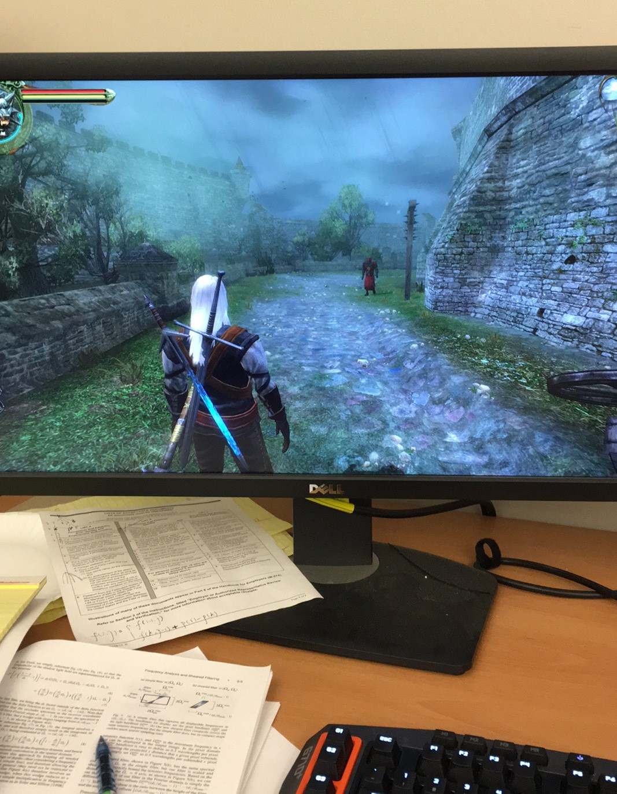
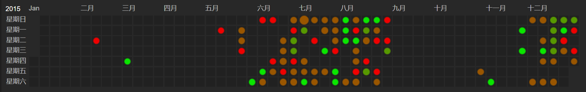
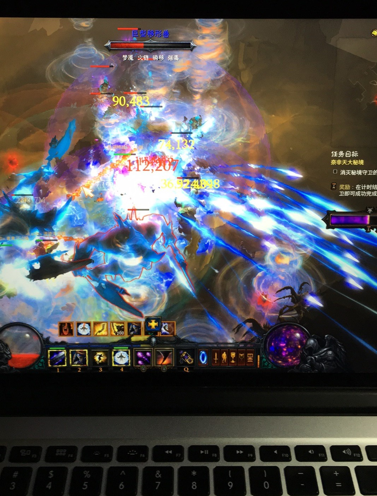
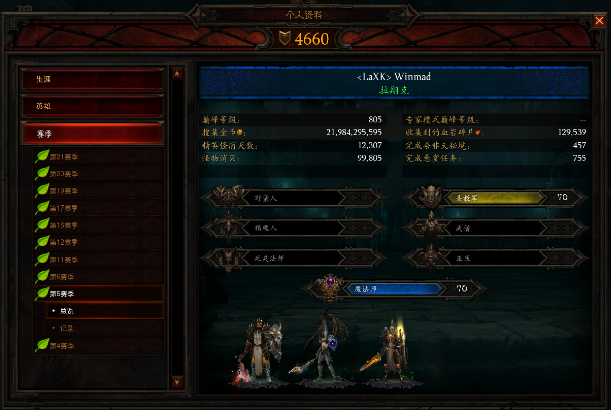
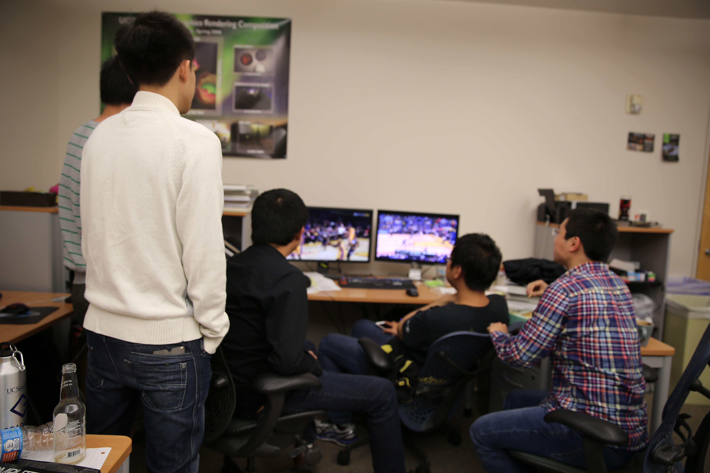
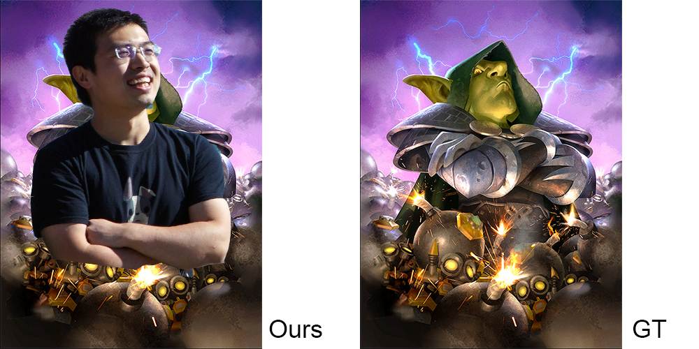
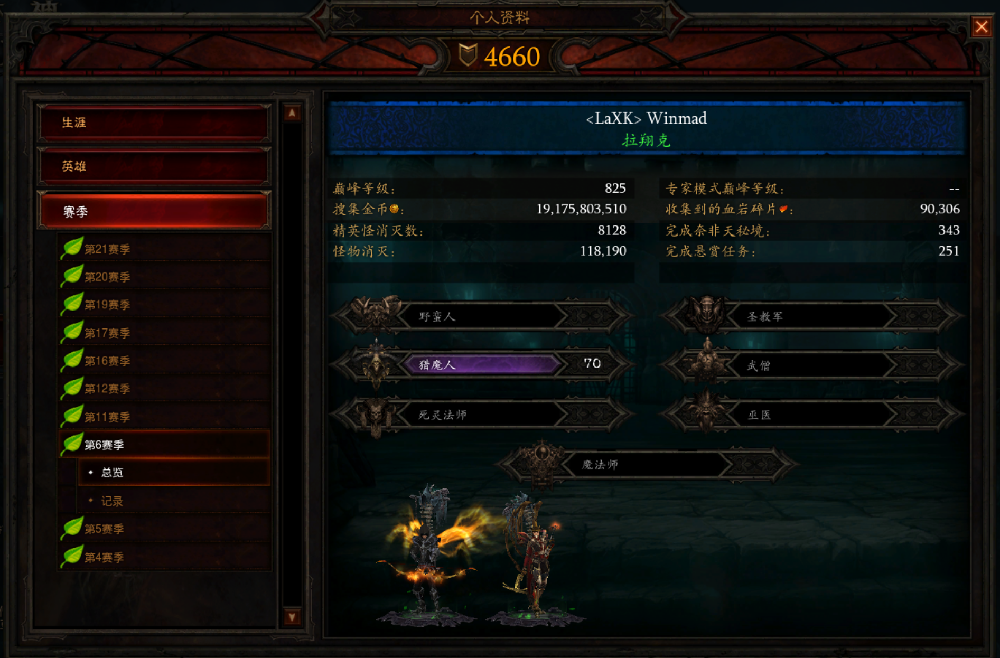



    <a href="/phd-games">
        [回到目录]
    </a>

 

# 第一年: 2015 -- 2016

九月初刚到美服开荒, 我的主要时间都用在适应全新的生活和学习上 (当时的一大活动是晚上在Chez Bob打台球).
闲暇之余, 我尝试过直接连国服暗黑3, 继续玩第4赛季.
可惜连国服的延迟基本在300 -- 1000毫秒之间, 体验不佳, 因此我就结束了第4赛季的旅程.

2015年11月10日, 星际争霸2三部曲的最后一部资料片虚空之遗正式上线, 为星际争霸的史诗故事划下了句点.
在上线的前一天, 是WCS世界总决赛. 
狗哥sOs大战7局, 力克牢本life, 获得了虫群之心版本的最后一个世界冠军.
狗哥不仅是目前唯一拿下WCS双冠的选手, 也是直至2020年最后一个神族冠军 (ToT 艾尔永不为奴).

虚空之遗刚一开放的那天, 我就开始玩剧情战役, 迫切地想知道故事的结局.
因为有了虫群之心的战役经历 (当时我和fuzerg在开服当天连续玩了20个小时左右打通最高难度战役), 我信心大增, 直接开了最高难度.
现在回忆起来, 剧情已经没有太多印象了, 只记得凯姐最终成神, 还有中二爆表的塔达林逼格第一人高坚果和拉克希尔仪式.

刚打通虚空之遗战役没几天, 我的邮箱里就收到了G胖万恶的邮件: Steam感恩节特卖促销活动开始了!
当时我的Steam游戏库空空荡荡, 只有孤独的Dota2.
各种降价的游戏琳琅满目, 让人难以选择.
我详细阅读了NGA游综区的各种推荐帖, 认识了波兰蠢驴这个公司, 入手了Witcher三部曲捆绑包.
我在办公室的机器上尝试了一下Witcher 3, 体验了在Alienware和GTX 980加持下的超高画质.
不过开场的故事让我感觉一头雾水.
我在百果园逛了一圈后, 就把它暂时放到一边了.

为了更好地体验Witcher系列的剧情, 我决定从第1代开始玩起.
令人欣慰的是, Witcher 1和2都能在Mac OS下运行.
Witcher 1一开场, 是杰洛特在凯尔莫罕"醒来" (在承接的小说剧情中, 杰洛特被一个农民用粪叉叉挂了), 失去了所有记忆.
在他还一脸懵B的时候, 凯尔莫罕就遭到了火蜥帮的血洗.
虽然很多人对第一代奇葩的战斗系统有不少吐槽, 我觉得还别有一番风味 (也可能是因为我开了低难度).
而它的剧情故事, 令我拍案叫绝.
特别是其中一段名侦探杰洛特的探案剧情, 我玩的时候并没有收集全所有线索, 后来看了攻略才知道事实真相.
在11月和12月里, 我慢慢推进着剧情, 逐步进入了Witcher的奇幻世界.

在12月里, 我同时也开始了Dota2的复健练习.
当时主要的开黑队友是超霸和他的小伙伴们.
我在西海岸裸连国服, 顶着200毫秒左右的延迟和他们开黑.
这对我的发挥毫无影响, 可能因为我玩的是逛街插眼的酱油吧.
我常常在开黑之前让代码在AWS上跑起来, 然后在盘中间隙看一眼有没有发生错误.
DotaMax上的活跃统计清晰地记录下了我的罪恶.

忙碌了一个学期之后, 终于到了圣诞假期.
但由于众所周知的原因, 做Graphics的人并没有圣诞假期.
于是, Steam的圣诞特卖成了我的一个解压方式.
我大肆购入了一批打折的经典游戏: Portal 2, Game of Thrones, 节奏地牢, Undertale, YS起源, YS 6, YS 菲尔盖纳的誓言.
当然, 其中有一大半的游戏我玩了不超过一个小时 (花钱买的游戏, 凭什么要花时间玩).
在这之后, 我面对Steam的各种促销, 心中再无波澜.
我感兴趣的游戏, 基本上都在第一时间入手了.

在美国的第一次跨年, 我选择了一个特别的方式.
晚上和同学们吃完饭之后, 我回到了办公室, 决定今晚把Witcher 1打通.
最后一章的剧情花了大概五六个小时.
一切都结束之后, 我在办公室里看见了新年的第一缕阳光.
稍作休息之后, 我切换到了工作模式, 写了一会code, 又在中午跟Ravi和Shuang讨论了一次.
Witcher 1的通关, 标志着我的第一次SIGGRAPH Rush正式开始.

SIGGRAPH deadline后, 正好赶上暗黑3第5赛季开始. 
当时得到巨大buff的是旋风法师, 从此开始了法师长达4年多组队大腿的地位.
由于延迟的原因, 我没法和别人组队冲层大秘境.
于是我又玩了一个适合单刷的散件轰炮豆角.
没有想到的是, 轰炮豆角在这之后几年一直无人问津. 
直到2020年10月的ptr测试版中, 这个build又得到了暴雪爸爸数十倍的增强, 在天梯榜上独领风骚.

2016年上半年, 老大从Berkeley来到SD visiting.
作为Ravi group的大师兄, 老大的加入不仅提高了我们的学术水平, 还极大丰富了我们的课余生活.
比如说, 组织聚众围观NBA球赛.
有一次, 我们在会议室里用投影仪看勇士对雷霆的比赛, 一起为库里的半场三分绝杀欢呼.
又比如说, 在实验室掀起玩多人online贪食蛇(slither.io)的热潮.
正当老大操控着一条叫Ravi的贪食蛇与线上玩家勾心斗角的时候, Ravi走到了他的身后找他讨论问题.
此外, 还有聚众打炉石.

暗黑3第6赛季 三秒火

暑假: Pokemon Go.

Witcher 2

周末打星际

SIGGRAPH开会: YS起源

TI6, 单排

WoW 7.0 军团再临

