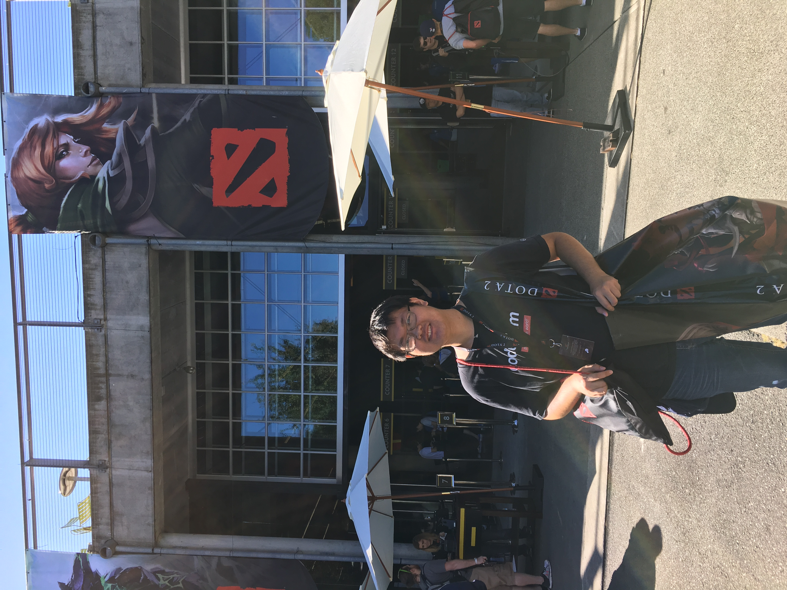
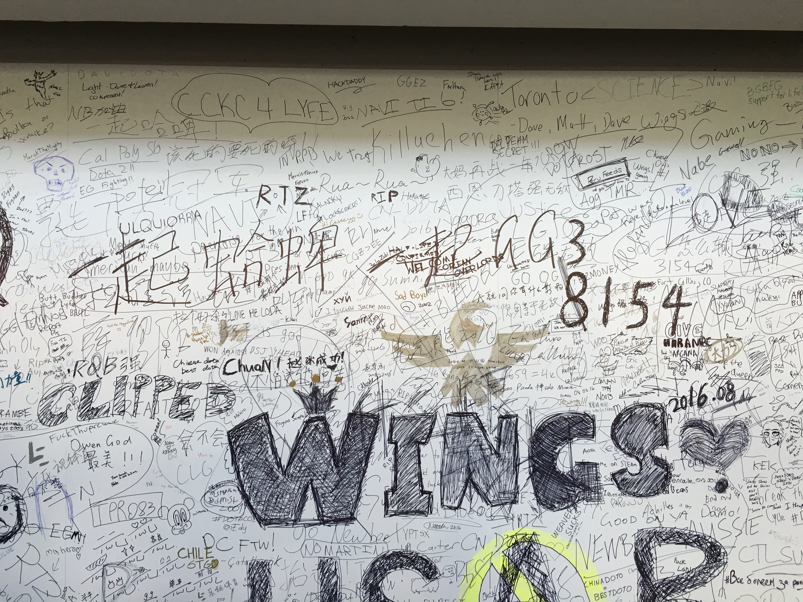
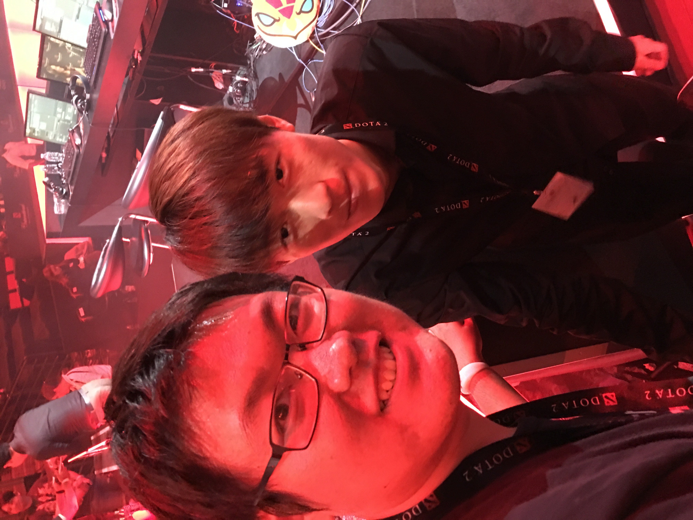
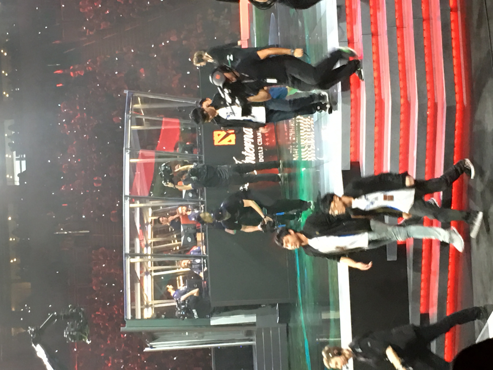
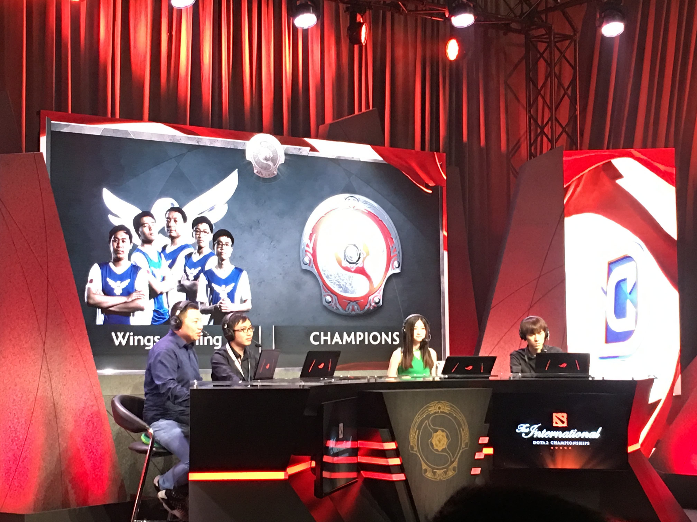
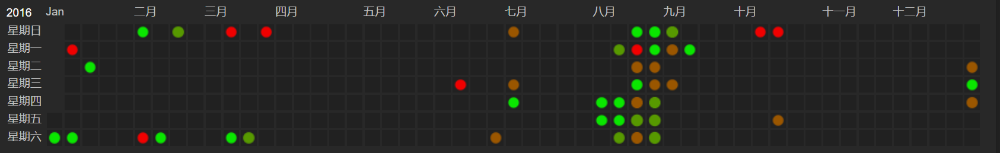



    <a href="/phd-games">
        [回到目录]
    </a>

 

# 第一年: 2015年9月 -- 2016年9月

九月初刚到美服开荒, 我的主要时间都用在适应全新的生活和学习上 (当时的一大活动是晚上在Chez Bob打台球).
闲暇之余, 我尝试过直接连国服暗黑3, 继续玩第4赛季.
可惜连国服的延迟基本在300 -- 1000毫秒之间, 体验不佳, 因此我就结束了第4赛季的旅程.

2015年11月10日, 星际争霸2三部曲的最后一部资料片虚空之遗正式上线, 为星际争霸的史诗故事划下了句点.
在上线的前一天, 是WCS世界总决赛. 
狗哥sOs大战7局, 力克牢本life, 获得了虫群之心版本的最后一个世界冠军.
狗哥不仅是目前唯一拿下WCS双冠的选手, 也是直至2020年最后一个神族冠军 (ToT 艾尔永不为奴).

虚空之遗刚一开放的那天, 我就开始玩剧情战役, 迫切地想知道故事的结局.
因为有了虫群之心的战役经历 (当时我和fuzerg在开服当天连续玩了20个小时左右打通最高难度战役), 我信心大增, 直接开了最高难度.
现在回忆起来, 剧情已经没有太多印象了, 只记得凯姐最终成神, 还有中二爆表的塔达林逼格第一人高坚果和拉克希尔仪式.

刚打通虚空之遗战役没几天, 我的邮箱里就收到了G胖万恶的邮件: Steam感恩节特卖促销活动开始了!
当时我的Steam游戏库空空荡荡, 只有孤独的Dota2.
各种降价的游戏琳琅满目, 让人难以选择.
我详细阅读了NGA游综区的各种推荐帖, 认识了波兰蠢驴这个公司, 入手了Witcher三部曲捆绑包.
我在办公室的机器上尝试了一下Witcher 3, 体验了在Alienware和GTX 980加持下的超高画质.
不过开场的故事让我感觉一头雾水.
我在百果园逛了一圈后, 就把它暂时放到一边了.

为了更好地体验Witcher系列的剧情, 我决定从第1代开始玩起.
令人欣慰的是, Witcher 1和2都能在Mac OS下运行.
Witcher 1一开场, 是杰洛特在凯尔莫罕"醒来" (在承接的小说剧情中, 杰洛特被一个农民用粪叉叉挂了), 失去了所有记忆.
在他还一脸懵B的时候, 凯尔莫罕就遭到了火蜥帮的血洗.
虽然很多人对第一代奇葩的战斗系统有不少吐槽, 我觉得还别有一番风味 (也可能是因为我开了低难度).
而它的剧情故事, 令我拍案叫绝.
特别是其中一段名侦探杰洛特的探案剧情, 我玩的时候并没有收集全所有线索, 后来看了攻略才知道事实真相.
在11月和12月里, 我慢慢推进着剧情, 逐步深入了Witcher的奇幻世界.

在12月里, 我同时也开始了Dota2的复健练习, 主要的开黑队友是超霸和他的小伙伴们.
我在西海岸裸连国服, 顶着200毫秒左右的延迟和他们开黑.
这对我的发挥毫无影响, 可能因为我玩的是逛街插眼的酱油吧.
我常常在开黑之前让代码在AWS上跑起来, 然后在盘中间隙看一眼有没有发生错误.
DotaMax上的活跃统计清晰地记录下了我的罪恶.

忙碌了一个学期之后, 终于到了圣诞假期.
但由于众所周知的原因, 做Graphics的人并没有圣诞假期.
于是, Steam的圣诞特卖成了我的一个解压方式.
我大肆购入了一批打折的经典游戏: Portal 2, Game of Thrones, 节奏地牢, Undertale, YS起源, YS 6, YS 菲尔盖纳的誓言.
当然, 其中有一大半的游戏我玩了不超过一个小时 (花钱买的游戏, 凭什么要花时间玩).
在这之后, 我面对Steam的各种促销, 心中再无波澜.
我感兴趣的游戏, 基本上都在第一时间入手了.

在美国的第一次跨年, 我选择了一个特别的方式.
晚上和同学们吃完饭之后, 我回到了办公室, 决定今晚把Witcher 1打通.
最后一章的剧情花了大概五六个小时.
一切都结束之后, 我在办公室里看见了新年的第一缕阳光.
稍作休息之后, 我切换到了工作模式, 写了一会code, 又在中午跟Ravi和Shuang讨论了一次.
Witcher 1的通关, 标志着我的第一次SIGGRAPH Rush正式开始.

SIGGRAPH deadline后, 正好赶上暗黑3第5赛季开始. 
当时得到巨大buff的是旋风法师, 从此开始了法师长达4年多组队大腿的地位.
由于延迟的原因, 我没法和别人组队冲层大秘境.
于是我又玩了一个适合单刷的散件轰炮豆角.
没有想到的是, 轰炮豆角在这之后几年一直无人问津. 
直到2020年10月的ptr测试版中, 这个build又得到了暴雪爸爸数十倍的增强, 在天梯榜上独领风骚.

2016年上半年, 老大从Berkeley来到SD visiting.
作为Ravi group的大师兄, 老大的加入不仅提高了我们的学术水平, 还极大丰富了我们的课余生活.
比如说, 组织聚众围观NBA球赛.
有一次, 我们在会议室里用投影仪看勇士对雷霆的比赛, 一起为库里的半场三分绝杀欢呼.
又比如说, 在实验室掀起玩多人online贪食蛇(slither.io)的热潮.
正当老大操控着一条叫Ravi的贪食蛇与线上玩家勾心斗角的时候, Ravi走到了他的身后找他讨论问题.
此外, 还有聚众打炉石.

作为一个从没上过传说的炉石选手, 我离传说最近的时候就是老大在SD期间.
我们经常两个人坐一起边讨论边打, 尽可能减少了失误和伏笔, 充分体现了pair programming的优越性.
当时版本的三巨头是佛祖骑 (6费佛祖, 7费砰砰, 8费弗丁死亡三连), 打脸萨 (石化武器+毁灭之锤!) 和咆哮德 (9费空场14点斩杀).
有一天下午, 我们的运气特别好, 用打脸萨一路连胜, 打到了1级3颗星, 离传说就剩3个净胜场.
结果那天晚上回家之后, 老大不甘寂寞, 自己打天梯冲分, 结果跌到了3级.
冲传说之路就此戛然而止.

五月SIGGRAPH Asia deadline之后, 我回国休息了3个星期.
期间正赶上暗黑3第6赛季.
我玩了一个DH, 感受到了什么是"天下第一火多重".
不过那个赛季的王者仍然是法爷, 因为"三秒火"的bug (暴雪无法在赛季中修复, 就成了feature).
这个IMBA的机制是, 如果你的伤害低于一个上限, 就会触发一个乘法叠加的增伤, 让伤害远超其他build.
这也造成了一个奇观, 法师附魔装备的时候要拼命洗掉增伤的词缀, 以便把伤害压低到触发bug的上限之内.

暑假的时候, 我来到了Google Mountain View, 开始我的第一次实习.
7月初, Pokemon Go震撼推出, 风靡全球.
各路亲朋好友都在世界各地捕捉小精灵.
我经常利用中午吃饭的时间, 在走去餐厅的路上抓小精灵, 摸鱼时间可以长达一个小时.
在一次吃完晚饭走去停车场的路上, 我成功收集到一只皮卡丘, 了却了我最大的心愿.
另我惊奇的是, 时隔4年之后, 我在UCSD的shuttle上还能见到有人在玩这个游戏 (老大也坚持玩了一两年).

有句话说得好, 暑假就是全美CS学生齐聚湾区的时候.
fuzerg当时在fb实习, 公司提供的公寓离我住的地方只隔一个高速路口.
我经常周末和他一起吃饭, 然后到他的公寓打星际.
因为很长时间没打了, 我们从合作模式打埃蒙开始复健, 偶尔打一打2v2.
我还常常在他新买的Alienware laptop上玩GTA5.
我的车技让当时还没有驾照的fuzerg惊叹不已 (lol).

解决完SIGGRAPH Asia rebuttal之后的一个周末, 我怒刷30个小时, 打通了Witcher 2.
第2代Witcher使用了新引擎, 画面和手感得到了进一步提升.
它的开场动画更是令我震惊, 光头哥雷索潜入游船上, 干掉了守护德马维国王的守卫和法师, 割下了他的头.
然后雷索又刺杀了德国骨科妹控国王, 杰洛特作为背锅侠锒铛入狱.
好基友Roche (不是坐骑Roach!) 偷偷把杰洛特放了出来.
杰洛特再次踏上成为名侦探的道路, 目标是找到凶手, 洗刷自己的冤屈.

虽然波兰蠢驴在游戏战斗上的手感为人诟病 (那个大乌贼boss太令人费解了, 看了视频攻略才会打), 但叙述的故事依然精彩.
Witcher 2的线索是北方诸国与尼弗迦德的冲突与政治阴谋, 为下一代的剧情做了铺垫.
另外, 它独特的一点是, 在第一章之后需要你选择主线剧情的方向, 是支持Roche还是松鼠党.
作为"有恩必报, 知恩图报"的优秀银行职员杰洛特, 我当然选择了给我机会洗刷冤屈的好基友Roche.
也许以后有时间应该也看一下松鼠党的剧情.

下一个周末, 我开始玩伊苏起源.
小时候玩伊苏6, 并没有感觉打boss的时候有太大的压迫感和紧张感 (可能是以前更不怕死了重来吧).
而多年之后再玩伊苏系列, 有一些boss还是给我造成了不少麻烦.
在出发去SIGGRAPH之前, 我用Hugo打通了游戏.
然而一切并没有结束, 用欧豆豆通关可以解锁Aniki.
为了解锁故事的真·结局, 我还要用Toal再通一次二周目.
于是在开会那几天的晚上, 我回到酒店之后就开始打起源, 很快就看到了真结局.

要说2016年最美好的游戏记忆, 毫无疑问是TI6.
那时的我们, 还深信CN Dota的偶数年定律, 却万万没想到这是目前为止中国最后的冠军.
作为Dota的老粉丝, 来到美国后自然要到钥匙球馆现场看TI.
TI门票大概在三四月的时候开放购买, 抢购门票的过程一言难尽. 
全世界的抢票系统都一样烂.
在网页端多次尝试未果后, 我发现用手机app购票居然畅通无阻, 于是立刻买下2张决赛日的门票, 与迪霸相约同行.

TI6上中国战队整体表现并不理想, 决赛日之前每天都要送走一支中国队.
在出发去西雅图的前一天, 大家还看到了EHOME出了超级兵被翻盘的名场面.
当我们抵达西雅图时, 只剩下全村最后的希望, Wings.

观赛第一天, 由于上午没有Wings的比赛, 我们到了现场之后就直奔神秘商店取货.
钥匙球馆外面除了神秘商店之外, 草坪上还有实时转播比赛的大屏幕 (没有门票的观众可以免费在场外围观).
外场还放了一个主宰雕像, 各种coser也是随处可见.
走进场馆, 眼前就是一块涂鸦墙, 充分体现了世界各地Dota玩家的热情.
场馆里赛场外的一圈, 散布着各个语种的转播团队和技术台.

Wings和EG的胜者组决赛大概在下午1点钟开始.
我们找到了中国观众的聚集区, 正好在中文解说台的正后方.
比赛开始前半小时左右, 解说进场调试设备.
我一眼看见了含泪解说的塞老师, 就立刻跟随大部队过去排队要签名跟合影.
轮到我的时候, "Hello塞垃圾"差点脱口而出.

关键的比赛终于开始了.
在现场看比赛, 中国vs世界的气氛达到了极致, 更不用说EG战队就在主场作战.
全场观众排山倒海的"USA! USA!"连绵不绝, 我们也不断高呼"Wings! Wings!"加以回应.
所幸巅峰的Wings还是技高一筹, 天马行空的ban-pick把美国队长ppd打得一头包.
下面这张照片就是第一局结束之后, Wings的队员们淡定离场休息, 留下了对战房里正在讨论总结的EG五人.
接下来的第二局也是轻松拿下, 把卫冕冠军送下败者组.
"USA"的口号戛然而止, 取而代之的是"Wings"的欢呼.
由于获胜之后的兴奋以及对赛后诸葛烤鱼的憧憬, 之后那场DC对Fnatic的比赛完全没有认真看.

决赛日的第一场比赛是EG和DC的外战.
因为隔岸观火, 我看比赛的心态非常轻松.
小高潮发生在决胜局的最后时刻, EG稍稍占优, 却被Moo的兽王偷了一路还是两路高地, 最终EG爆冷出局.

总决赛开始前, 交响乐团先演奏了Dota和这届TI的主题曲, 感觉很赞.
第一局, Wings点了一手屠夫.
结果并没有打出效果, 先送了DC一分.
虽然DC是欧洲区的队伍, 全场依然高呼"USA".
出师不利, 所有中国观众都略微有些紧张.
第二局Wings没有再在BP上选什么妖路.
整场比赛都非常焦灼, 看不出哪一方有明显优势, 直到Wings打赢了一波关键团.
顺利扳平比分之后, 大家才松了一口气.
第三局就显得轻松很多了, Y队的神谕前期大杀四方, faith_bian的小强淡定开壳反杀, 当然还有shadow虚空不讲道理的无限敲晕.
第四局, Wings手握赛点, BP也浪了起来.
先是光法大牛双酱油, 然后想用蝙蝠中单发现被克, 最后随机应变点了一个斧王, 全队四保一敌法师.
对线期是熟悉的Wings被乱干的节奏, 所幸敌法发育尚佳.
最终用完美的团战和著名的blink"回头一笑"终结了比赛, 成功举盾.

Wings夺冠之后, 中国的观众们自然兴奋异常.
DC老师带领大家在钥匙球馆唱起了国歌.
离开场馆之后, 我们和迪霸的两个朋友一起去吃饭.
我们先去了玛雅串吧, 结果得知这里已经被Wings包场了.
在我们准备离开的时候, 有人发现从包厢里走出来一个人, 根据身高判断应该是iceice.
等我反应过来的时候, 人影已经消失了.

TI6的冠军严重激发了我的Dota热情, 我居然开始天梯单排了.
美服鱼塘似乎要比国服容易打一些. 
我用小黑接连拿下了两三场胜利.
最终我在剩下两把出分的时候停止了单排.
这可能是我离出单排分最近的一次吧.

到了8月底, WoW 7.0资料片军团再临上线.
我之前听说PD在美服玩WoW, 想找他一起玩.
准备联系的时候, 我发现并没有PD的微信.
但是有灵性的我立刻想到一个点子.
我去Princeton他们组的主页上找到了PD的邮箱, 给他发了一封邮件.
五分钟之后我就收到了回复, 看来Email果然是联系PhD学生最好的方法.
我还拉了J神一起重返艾泽拉斯, 结果这厮勉强升到100级就把我们鸽了.

在选择职业方面, 我依然开了一个术士号, 不过这次是部落的兽人术士.
由于7.0的前夕剧情让不少知名人物领了便当, 每个职业天赋都可以通过剧情领到一把橙色武器 (弗丁你也有装备被黑的一天).
毁灭术士的神器叫萨格拉斯的权杖, 一听上去就逼格爆表, 于是我毫不犹豫地入手了.
通过一段时间的升级, 做日常, 刷声望, 我终于进入了苏拉玛城区.
在苏拉玛的时候, 我最常听到的NPC台词来自苏拉玛卫兵: "这是幻象, 你在掩饰什么?"
之后便是他们识破了我的伪装, 把我打得落荒而逃.

这个版本的一大特色是加入了很多世界掉落的橙色装备.
其中一些核心橙能给人物带来强力的提升, 每一件背后都是欧皇满满的炫耀和非洲人悲伤无奈的泪水.
在追寻我的第一件橙装的途中, 我结束了在Google的实习, 回到SD开始第二年的生活.
