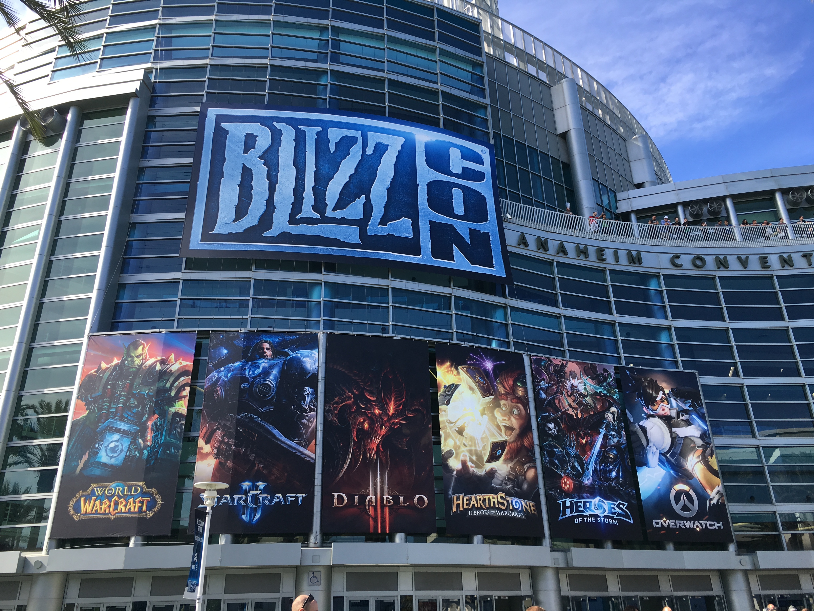
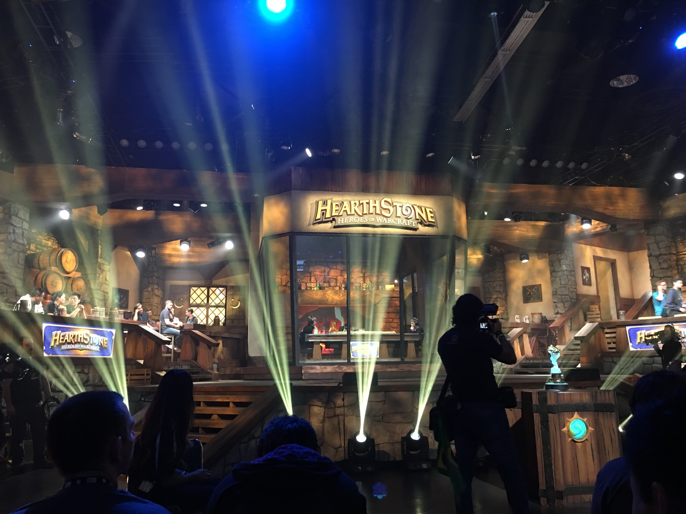
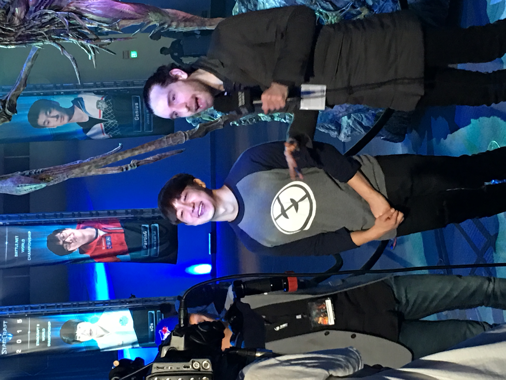
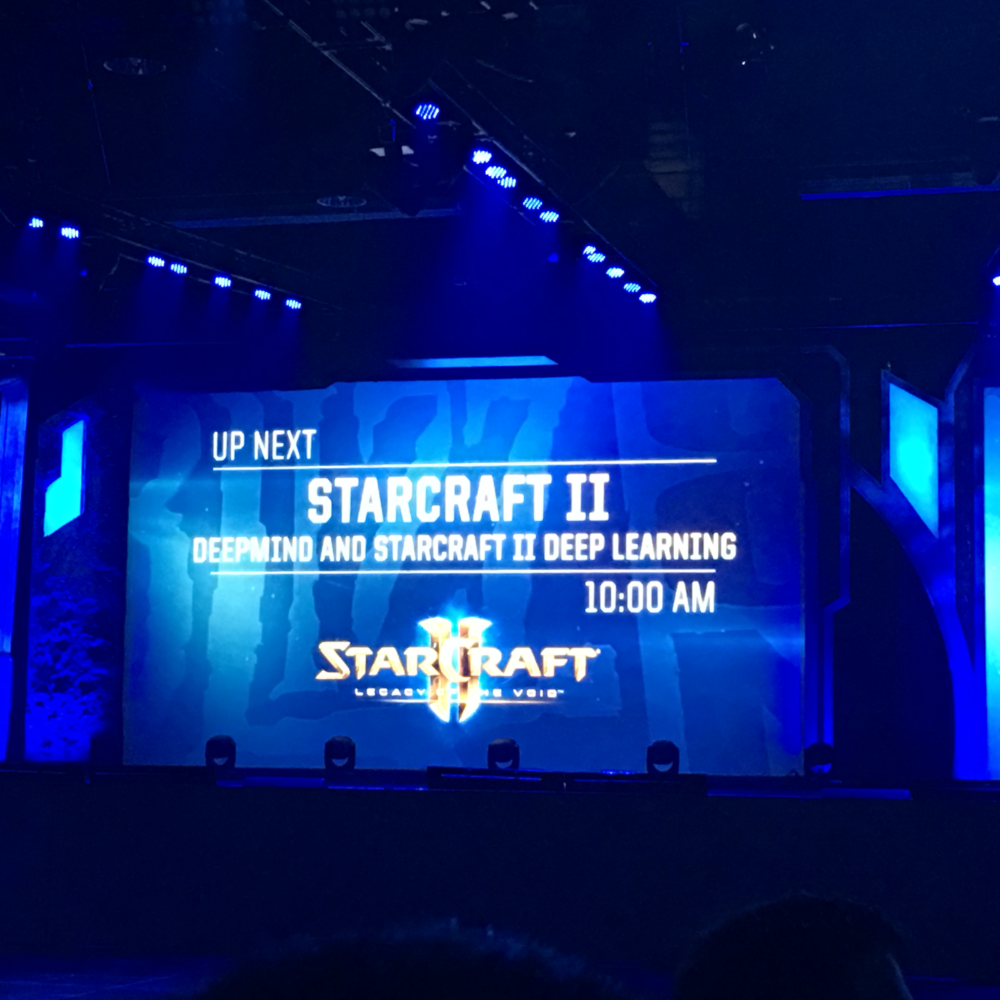
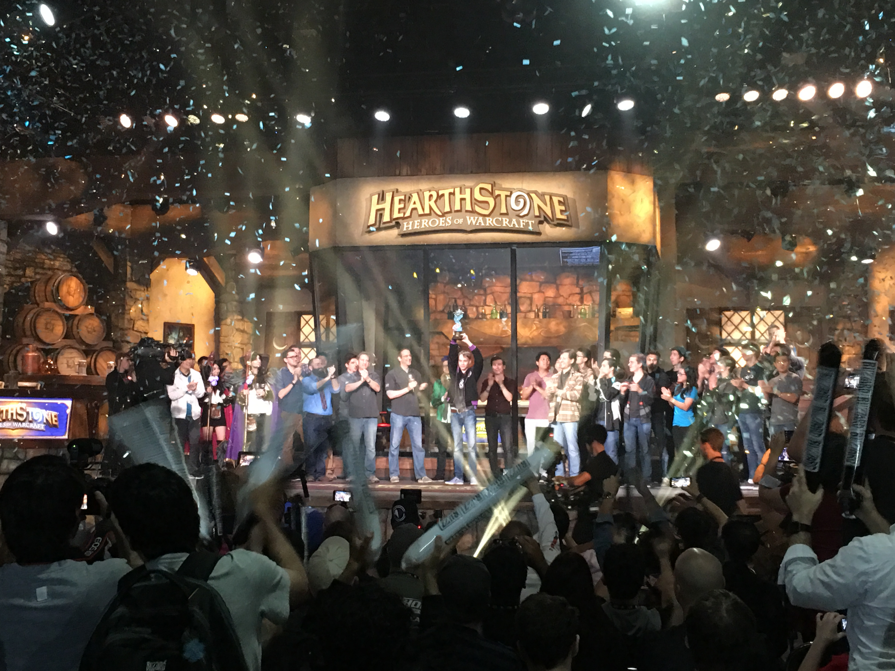
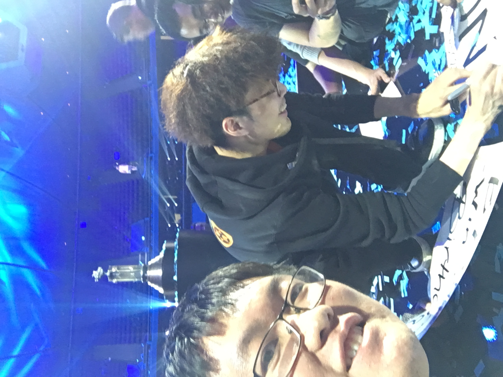
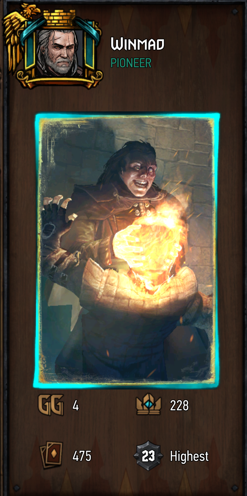



    <a href="/phd-games">
        [回到目录]
    </a>

 

# 第二年(上): 2016年9月 -- 2017年2月

回到SD的第一个月, 我基本都在肝魔兽世界.
每天有日常任务开箱子, 每周有世界Boss和大秘境低保.
如果你加入一个团队打Raid, 那么玩起来可能要比上班还辛苦.
我所在的公会按照东部时间活动, 三个小时的时差着实麻烦.
我只跟我们公会的人混过一次普通难度的翡翠梦魇, 唯一的记忆是, 打塞纳留斯的时候没多久就扑街了.
有趣的一点是, 我后来加入公会的微信群, 竟然发现本科同学秤哥也在这个公会, 真是神奇.
放弃了Raid之后, 我以比较休闲的方式玩了一段.
终于在10月底, 得到了我的第一件橙装.
遗憾的是, 这个橙色戒指的特效并没有什么卵用, 无法给我的术士带来本质的提升.
随着橙装落入袋中, 我对WoW的盼头又减了一分, 离AFK越来越近了.

11月初, 我第一次到安纳海姆<del>议事堂</del>参加了暴雪嘉年华.
一方面, 住在南加州有天然的便利, SD距离Irvine的暴雪总部只有一小时左右的车程.
另一方面, 通过Shuang的帮助, 他以前的PhD同学Shuo帮我买到了门票.
Shuo在暴雪工作, 也是我的THU学长, 我们由这次暴雪嘉年华初次相识.
在未来, 我们因为对游戏的热爱有了更多的交流, 此为后话, 暂且不表.

我在11月4日中午驾车前往安纳海姆的convention center.
刚开到广场附近, 就能看到巨大的人流, 大部分人正在买午饭, 也能看到很多coser.
走进场馆, 里面被划分成很多区域, 有纪念品商店, 粉丝互动区, 游戏试玩区(最火的应该是暗黑3的死灵法师试玩)以及WCS世界总决赛的舞台和观赛区.
我粗略逛了一下其他展区, 之后就直奔炉石赛场.
毕竟我此行关注的主要项目, 是星际2和炉石的WCS世界总决赛.

炉石的第一天赛程是8进4淘汰赛.
我在观众区找到了Shuang和他一起观战.
我错过了第一场两位中国选手的内战.
第二场比赛中, Pavel展现出了强大的欧洲人血统, 一波让三追四成功大逆转.
局间休息的时候, 有工作人员向观众席扔奖品.
我难得欧了一回, 抢到一个炉石抱枕.
还有一件值得orz的事情是, Shuang在局间淡定掏出电脑改proposal, 展现了强大的多线能力.

看了一会炉石之后, 我们转战前往星际2的赛场.
2016年的时候, 星际项目还很有牌面, 占据了最大的场馆(后来都给守望了).
比赛舞台搭得也非常炫酷, 左右两个屏幕会根据选手的种族做不同的变化.
在通往赛场的路上, 摆放着凯瑞甘, 雷诺等人物雕像, 两旁悬挂着历年WCS总冠军的旗帜.
我还在途中围观到了正在接受采访的Jaedong大魔王, 遥想当年, 他也是征战在赛场上的全球总亚军.
星际第一天的赛程也是8进4, 并没有留下什么印象.
晚些时候, 我们又看了一会风暴英雄, 只记得有一个战队名字叫“Please Buff Arthas”.

第二天一早我们来到场馆, 首先去的是暴雪和Deepmind的一个presentation.
内容主要是介绍他们在AI和Deep learning里的一些合作, 揭开了AlphaStar项目的序幕.
在暴雪嘉年华, 你甚至可以听技术Talk!

在这之后, 是炉石项目的半决赛和决赛, 我和Shuang继续来到赛场观战.
第一场是中国选手JasonZhou和Pavel的半决赛.
不得不说, 咖喱周确实黑得不行, 再加上Pavel继续欧皇附体.
我印象最深刻的是Pavel的火妖法, 各种随机效果的卡牌(魔典, 火妖, 传送门)都打出了接近最优的效果, 甚至有传送门出5/7冲锋大哥这种操作.
面对这样的欧皇, 你还能说什么呢?
最终的决赛, 欧皇Pavel继续轻松战胜了对手, 成功捧杯.

相比于炉石决赛的波澜不惊, 星际2的决赛则激烈许多, 堪称史上最精彩的TvZ对决之一.
率先进入决赛的是虫族选手沸羊羊Dark, 他的对手是刚刚离开Xteam, 回到韩国GSL体系的人族选手ByuN.
双方选手当时都处于自己的巅峰水平, 特别是ByuN, 在决赛中多次展现出枪兵诸葛连弩点毒爆的惊人操作(在这之后, ByuN一直深受手部伤病困扰, 人称“断手人族”. 再加上服兵役的因素, 他于2019年宣布退役. 在退役前, 他又和Dark打了一场BO11的告别赛, 留下了TvZ的“武穆遗书”. 目前, 他已服完兵役, 重返星际赛场.)
虽然在现场无法听到scboy的解说, 但围绕在现场千余观众的热烈氛围中, 听着英文解说台的激情呐喊, 也有非常不错的观赛体验.
最终, ByuN以更高一筹的表现战胜了Dark, 举起了看起来非常重的冠军奖杯.
我在赛后立刻冲到舞台前端向ByuN要签名, 开心的ByuN对粉丝的要求也是来者不拒.
后来赛宁说, 他在Twitch的直播流里看见了我.
嘉年华的最后, 暴雪请来了著名谐星“Weird Al” Yankovic, 给观众们带来了一场精彩的live show.
其中我觉得最有趣的一首歌, 是改编自Happy的[Tacky](https://www.youtube.com/watch?v=zq7Eki5EZ8o&list=RDEMVipGsy3wVwcf_KORCbD2Mg&index=14&ab_channel=alyankovicVEVO).

在暴雪嘉年华的这几天, 我住在Shuang的家里.
作为我的重要导师, <del>学术</del>游戏上的交流自然必不可少.
我提到我正在魔兽世界里玩一个术士, Shuang说他在60年代也是一名术士.
他还向我介绍了血神哈卡的[堕落之血bug](https://zh.wikipedia.org/wiki/%E5%A0%95%E8%90%BD%E4%B9%8B%E8%A1%80%E4%BA%8B%E4%BB%B6).
没想到这个著名bug到了2020年, 因为COVID病毒又一度引起讨论.
另外, 他还说起他在读PhD的时候(当时是巫妖王之怒的版本), 利用中立拍卖行做倒爷, 成为服务器首屈一指的大富豪, 金币达到游戏上限, 令我深深orz.
不过, Shuang对我游戏生涯更深远的影响, 是介绍我入坑了魂系列游戏.
他在PS4上向我展示了黑魂3和血源: 魂3的第一个boss古达, 法兰要塞的篝火处刷发青舌头, 第一个DLC的雪原群狼(当时看到这些场景的演示并没有特别的感觉, 后来我自己玩的时候走到这些地方, 总会感慨“啊原来是这里!”), 还有血源各种武器炫酷的变形斩.
这充分引起了我对魂系列游戏的兴趣, 也成为了我在感恩节入手PS4的一大动力.

暴雪嘉年华之旅结束之后, 我满载而归回到SD.
当时正值文明6发售不久, 我对这个系列的大名早有耳闻(本科的时候振哥就经常玩文明4和5, 跟朋友们联机很有乐子; 我校的YY教授当年选择加入UCSD, 正是因为学校送了她一份文明游戏), 于是果断入手了新作.
我早就听说, 玩文明犹如“吸毒”, “下一回合”的诱惑会让人无法自拔, 下午开始一局游戏, 可能不知不觉就玩到了第二天天亮.
我自认为身经百战了, 西方的什么游戏没有见过, 上瘾是不可能的.
结果, 刚开始玩新手教程我就觉得真香, 几个小时很快就过去了.
我觉得我之所以对于“下一回合”如此着迷, 一方面是因为对未探索的地图的好奇, 另一方面是对充分运营后所得到的美好未来的向往.
游戏另一个吸引我的地方是它的音乐, 每一个文明都用它历史上著名的曲子作为基调(比如中国的曲子是“茉莉花”), 再根据时代的不同(远古, 中世纪, 工业革命, 现代)进行变调, 极有韵味(在一段时间内它们是我开车的BGM).
我沉浸与文明6的这段时间, 正好是SIGGRAPH Asia开会前一个月, 我需要准备会议报告的slides.
由于是我第一次做正式会议的presentation, Ravi和Shuang都给我的slides和讲稿提了非常多的建议, 我也花了很多时间对其进行反复修改.
有一天晚上, 我又开了一局文明, 打通的时候天已经快亮了.
然后我又一鼓作气开始改slides, 录了视频发给Ravi之后才去睡觉.
总之, 文明6是一个神奇的游戏, 大家千万不要不信邪, 不服的话欢迎尝试, 后果自负:)

去澳门开会是在十二月初.
在回国之前, 我趁着感恩节打折买了一台PS4 Slim(神秘海域4的bundle; 我第一次听说神海4是在SIGGRAPH 2016上, 顽皮狗有一个相关的技术talk, 现场座无虚席), 也入手了黑魂3(盘)和Witcher 3(数字版).
收到PS4后, 我只是简单开机验了一下货, 然后就立刻把它塞进行李箱, 踏上了回国的飞机.
开会的场馆在澳门威尼斯人酒店, 每天去听报告都要路过楼下的赌场.
由于当时正逢期末, 我的两门课都有万恶的take home final, 于是我开会的大部分空闲时间都在酒店房间里写final.
这可能是我最差的开会体验了.

会议结束之后我回家待了近一个月, 在此期间我开始用PS4玩神秘海域4.
神海4的游戏画面非常精致, 各个方面也都polish得不错.
可惜我不是很喜欢枪战, 一些解谜关卡还有点意思, 吸引我玩下去的动力主要是看剧情.
我花了大概一星期通了主线, 大团圆的故事现在已经忘得差不多了, 只记得德雷克走哪哪就塌.

在国内的时候, 我通过淘宝买了港版血源.
然而, 我的血源初体验因为亚楠人民的热情好客, 在亚楠篝火晚会处戛然而止.
我决定先去玩Witcher 3, 而且开最低难度!
这次我耐心通过了初期百果园慢热的剧情, 终于踏入了新天地(威伦, 诺维格瑞和史凯利格群岛).
我也随着剧情的推进, 越来越沉浸其中, 再次体验到了波兰蠢驴强大的剧本和表现力.
不管是主线或支线的故事, 依然是“两害相权取其轻”.
很多时候, 我会因为剧情选择而纠结(比如林中夫人和血腥男爵任务线).
当我因为看到bad end而读档重选的时候, 新选项导致的可能是更坏的结局.
同时, 跟很多玩家一样, 我也迅速沉迷于打昆特牌.
虽然很多时候打牌破坏了剧情的氛围: 尽管老婆跑了孩子没了, 你想来一局昆特牌吗?

新年刚过不久, 我回到了SD.
在慢慢推进Witcher 3剧情的同时(我是支线全清党), 我又重拾炉石开始打天梯.
当时强力的卡组是青玉萨, 我一路顺利地打到5级.
不过在这之后, 排到的对局十有八九是内战, 玩起来非常乏味.
从5级到传说的路程, 也需要付出不少时间和精力.
于是我的传说之路再次搁浅, 这也是我最后一次冲传说的尝试.

在基本告别炉石之后, 波兰蠢驴带来了振奋人心的消息: 他们即将推出独立的昆特牌游戏, 现在就可以申请beta内测资格.
我在1月左右注册, 终于在2月中获得了内测资格.
我对昆特牌的第一印象, 是制作精美的卡牌插图, 特别是稀有的闪卡所拥有的卡图动画和音效(比如上面那张图里的威爷抱头杀, 动画版特别带感).
初步体验了几局, 让我对它有趣的游戏机制更加喜爱.
卡牌之间有很强的联动性, 比如一张牌可以通过牌组检索和连锁效果, 同时打出好多张牌, 所体现出的爆发力足以在一回合形成局面的大逆转.
为了达成这华丽的combo, 需要玩家在组牌和打牌时, 不停地进行计算.
这个新诞生的卡牌游戏让我感觉耳目一新, 同时许多炉石老玩家(比如lifecoach)也纷纷弃炉投昆.
凭借本身优秀的素质, 再挟Witcher 3的余威, 昆特牌成为卡牌游戏江湖中的新贵.

PS: 这篇来自旅法师营地的[文章](https://www.iyingdi.com/web/bbspost/detail/2279997)总结了内测时代昆特牌的版本历史.
