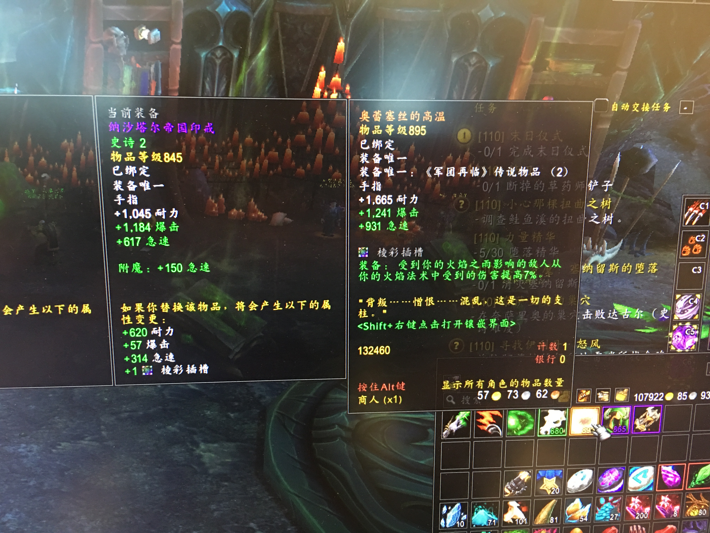
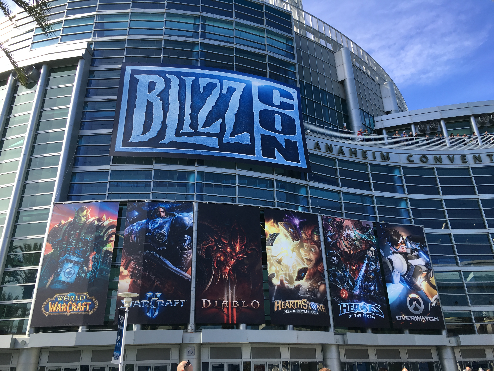
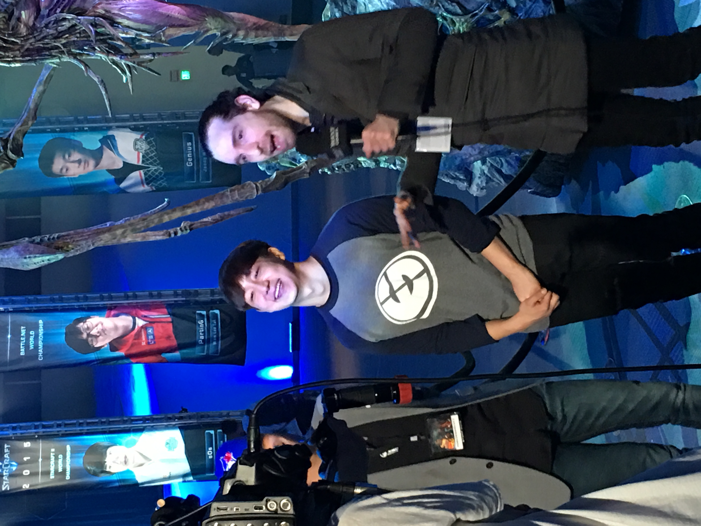



    <a href="/phd-games">
        [回到目录]
    </a>

 

# 第二年: 2016 -- 2017

回到SD的第一个月, 我基本都在肝魔兽世界.
每天有日常任务开箱子, 每周有世界Boss和大秘境低保.
如果你加入一个团队打Raid, 那么玩起来可能要比上班还辛苦.
我所在的公会按照东部时间活动, 三个小时的时差着实麻烦.
我只跟我们公会的人混过一次普通难度的翡翠梦魇, 唯一的记忆是, 打塞纳留斯的时候没多久就扑街了.
有趣的一点是, 我后来加入公会的微信群, 竟然发现本科同学秤哥也在这个公会, 真是神奇.
放弃了Raid之后, 我以比较休闲的方式玩了一段.
终于在10月底, 得到了我的第一件橙装.
遗憾的是, 这个橙色戒指的特效并没有什么卵用, 无法给我的术士带来本质的提升.
随着橙装落入袋中, 我对WoW的盼头又减了一分, 离AFK越来越近了.

11月初, 我第一次到安纳海姆(议事堂)参加了暴雪嘉年华.
一方面, 住在南加州有天然的便利, SD距离Irvine的暴雪总部只有一小时左右的车程.
另一方面, 通过Shuang的帮助, 他以前的PhD同学Shuo帮我买到了门票.
Shuo在暴雪工作, 也是我的THU学长, 我们由这次暴雪嘉年华初次相识.
在未来, 我们因为对游戏的热爱有了更多的交流, 此为后话, 暂且不表.

我在11月4日中午驾车前往安纳海姆的convention center.
刚开到广场附近, 就能看到巨大的人流, 大部分人正在买午饭, 也能看到很多coser.
走进场馆, 里面被划分成很多区域, 有纪念品商店, 粉丝互动区, 游戏试玩区(最火的应该是暗黑3的死灵法师试玩)以及WCS世界总决赛的舞台和观赛区.
我粗略逛了一下其他展区, 之后就直奔炉石赛场.
毕竟我此行关注的主要项目, 是星际2和炉石的WCS世界总决赛.

暴雪嘉年华+魂系列

文明6

感恩节入手PS4

神海4

血源

巫师3

星际2

炉石 青玉萨

昆特牌内测 2月

4月 购入Switch 荒野之息

dota2

血源

黑魂3

5月 public beta

5月底 UCSD 炉石赛

SIGGRAPH Thomas Osu, Splatoon 2

暑期 暗黑3 11赛季 死灵

荒野之息

TI7

昆特

